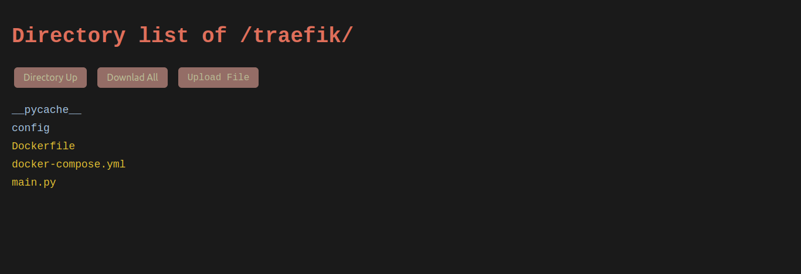

## Staser - Static Server



## Why Staser?

- Directory listing
- Easily modifiable frontend
- Upload files
- Download all files (one click)

## Quick Start

### instalation:

Optionally you can specify the installation paths (-h to see the default ones).

```shell
python3 install.py -h
```

### usage:

Simply specify the directory, ip(optional) and port(optional)

```shell
staser -d /etc/ -i 127.0.0.9 -p 1
```
